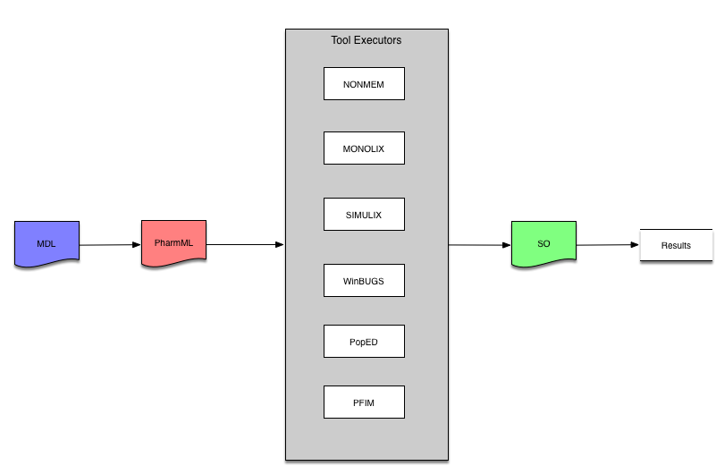

Welcome to the DDMoRe Foundation Interoperability Framework Site
=====================================================================

Here you can find information about the IOF and how to download and install it.

Quick Start Guide
-----------------------------

<!-- It's a simple as downloading the installer file, unzipping it, and running it: -->

* download the [latest release](http://downloads.mdl.community/repository/see/Foundation-2.0.1-alpha/see-installer-1.4.0-alpha-64b.zip)

* unzip to ```C:\see-installer```

* run the installer:

```
c:\see-installer> see.bat build full -in c:\see-full
```

This will install the IOF into the `c:\see-full` folder.

* run the application by double clicking the file: `c:\see-full\MDL-IDE\mdl_ide.exe`.

This will get you started with the public domain tools, but to use NONMEM and MONOLIX you will
need to do further configuration and possibly provide your own license (evaluation licenses are available).

Refer to the [full installation documentation](http://downloads.mdl.community/repository/see/Foundation-2.0.1-alpha/SEEInstallationGuide_Demonstrator2.0.1.pdf) for more detailed configuration and installation instructions.

_Note:_ the application only works on Windows 64 bit operating systems at the moment.


What is the Interoperability Framework
---------------------------------------

The IOF was developed by the [DDMoRe IMI project](https://www.ddmore.eu) to enable modellers
to use the interoperability tools and languages it developed.  The IOF is now maintained and provided
by the [DDMoRe Foundation](https://www.ddmore.foundation).

In essence the IOF enables you
to create and edit in a universal modelling language (MDL) via a convenient smart editor and
then run that model in a variety of M&S tools, such as MONOLIX, NONMEM, WinBugs, PopEd, Pfim
and Simcyp.  This is summarised below:




The latest release
---------------------

The latest release available from the DDMoRe Foundation is [Foundation-2.0.1-alpha](http://downloads.mdl.community/repository/see/Foundation-2.0.1-alpha/).
Each file contains an md5 checksum file.  After you downloaded the installer you should verify the integrity of the zip file before you process.
Details are available in the [installation guide](http://downloads.mdl.community/repository/see/Foundation-2.0.1-alpha/SEEInstallationGuide_Demonstrator2.0.0.pdf).


Tutorials
-----------

A number of videos were developed during the DDMoRe/IMI project to demonstrate how to use and install the IOF.
The playlist is [here](https://www.youtube.com/playlist?list=PL_GGUkhbiP3t0Q7wTqkQdMAw7yuC8xWa-).
